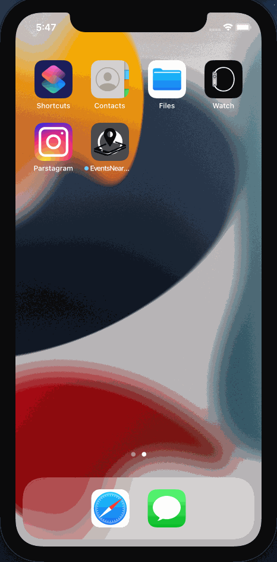

# EventsNearMe

## Table of Contents
1. [Overview](#Overview)
1. [Product Spec](#Product-Spec)
1. [Wireframes](#Wireframes)
2. [Schema](#Schema)

## Overview
### Description
Gather all types of events from Eventbrite in the local area. Users can search for an event. Events are listed in date order, or calendar view.


### App Evaluation
[Evaluation of your app across the following attributes]
- **Category:**
- **Mobile:**
- **Story:**
- **Market:**
- **Habit:**
- **Scope:**

## Product Spec

### 1. User Stories (Required and Optional)

**Required Must-have Stories**

* User can login
* User can search for an event
* User can like an event
* User can leave a comment for an event
* User can view a feed of events

**Optional Nice-to-have Stories**

* User can post events
* User can create a new account
* User can follow event organizer
* User can add photos to their comments

### 2. Screen Archetypes

* login screen
   * User can login
* events screen (tableView)
   * User can view a feed of events
   * User can view how many likes for each events
   * User can search for events
* events screen (calendarView)
   * User can view a list of events in calendar view
* events detail screen
   * User can like an event
   * User can leave a comment w./w.o. photo

### 3. Navigation

**Tab Navigation** (Tab to Screen)

* Events list view
* Events Calendar view

**Flow Navigation** (Screen to Screen)

* login screen
   * Home
* events screen (tableView)
   * event detail screen
* events screen (calendarView)
   * event detail screen
* events detail screen
   * none
   

## Wireframes
[Add picture of your hand sketched wireframes in this section]


## Schema 

### Models

Event

| Property     | Type                 | Description                                                                  |
| --------     | --------             | --------                                                                     |
| name         | multipart-text       | Event name.                                                                  |
| event_id     | string               | Event ID of the Attendee's Event.                                            |
| created      | datetime             | Attendee creation date and time (i.e. when order was placed).                |
| summary      | string               | (Optional) Event summary. Short summary describing the event and its purpose.|
| start        | datetime-tz          | Event start date and time.                                                   |
| end          | datetime-tz          | Event end date and time.                                                     |
| status       | string               | Event status. Can be draft, live, started, ended, completed and canceled.    |
| likesCount   | Number               | number of likes for the post                                                 |
| user         | Pointer to User      | image author                                                                 |
| comment      | Pointer to Comment   | comments                                                                     |

### Networking

* Events Screen (tableView)

   * (Read/GET) Query all events
  
    ```
    let query = PFQuery(className:"Event")
    query.whereKey("user", equalTo: currentUser)
    query.order(byDescending: "createdAt")
    query.findObjectsInBackground { (events: [PFObject]?, error: Error?) in
       if let error = error { 
          print(error.localizedDescription)
       } else if let events = events {
          print("Successfully retrieved \(events.count) events.")
      // TODO: Do something with events...
       }
    }
    ```
    * (Delete) Delete existing like
    * (Create/COMMENT) Create a new comment on an event

* Events Screen (calendarView)
   * (Read/GET) Query all events
   
* Events Detail Screen
   * (Delete) Delete existing like
   * (Create/COMMENT) Create a new comment on an event

### Milestone 10 build progress

### User Stories
- [x] User can sign up, login and logout
- [x] App retains user information after app is closed and re-opened
- [x] User can toggle between the AllEvents Tab and the Calendar Tab

### Walkthrough GIF - Milestone 10

<br>

### Milestone 11 build progress

### User Stories
- [x] User can view and scroll through a list of events in the app
- [x] User can view the event posters in each row
- [x] User can tap a cell to see more details about a particular event
- [x] User can tap the ticket button to get ticket information in the browser

### Walkthrough GIF - Milestone 11

<br>

### Milestone 12 build progress

### User Stories
- [x] User can create new comments on a particular event
- [x] Presenting events in a calendar view
- [x] User can tap on a cell to see more details about a particular event

### Walkthrough GIF - Milestone 12

<br>
